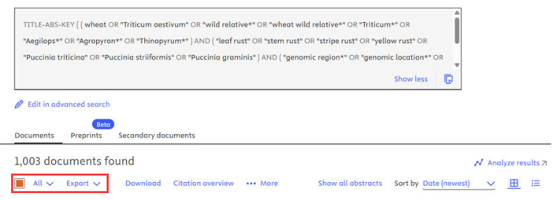
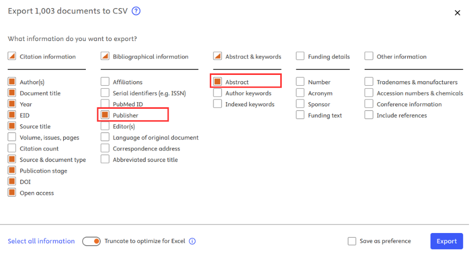

# Documentation for general usage.

----
## Installation and Setup.
The easiest way to install the package is using [pip](https://pip.pypa.io/en/stable/installation/) and 
[uv](https://docs.astral.sh/uv/getting-started/installation/).
```bash
pip install --upgrade pip
pip install uv
uv pip install biomarkit
```
### Storing publisher API keys.
This file is required for a biomarkit run – the software will pull environment variables from your defined `secrets.env` 
file once set up to do so. For new users we recommend storing `secrets.env` in the current working directory. 
Alternatively, you can specify the path of your secrets.env file using the `dotenv_path` parameter and the
following code:
```python
from dotenv import load_dotenv
load_dotenv(dotenv_path="path/to/secrets.env")
```
We provide a template [secrets.env](/secrets.env.example) file that can be copied and renamed to `secrets.env`.
This file acts as a template for you to fill in, to store any API keys for downloading papers from specific publishers, 
as well as other sensitive information including user emails which are required by some APIs such as 
[Unpaywall](https://unpaywall.org/).

## Generating a new corpus for download.
Biomarkit takes a [SCOPUS](https://www.scopus.com/pages/home#basic) search export in .CSV format as an input. If you are
unfamiliar with the process of generating this file, follow the instructions below:

1) Write your SCOPUS query - tips available [here](https://www.scopus.com/standard/help.uri?topic=11365&anchor=tips).
2) Run your search [here]([https://www.scopus.com/search/form.uri?display=advanced]). Using the advanced search tool.
3) On the result page, add any additional filters you wish to apply using the right-hand column, then click this box to 
select all results:

4) Next to the select-all button, click "Export", then select "CSV", then tick the boxes as shown below:

5) Wait for your export to complete (may take some time for large queries), once downloaded, rename the CSV file to 
`scopus.csv`.
6) In Python, run the function below to generate a new `biomarkit` corpus: 

```python
from main import build_new_corpus
build_new_corpus(name="my_new_corpus", scopus_file="/path/to/my/scopus.csv", set_active=True)
```

The function will automatically generate the following folder structure. By default, new corpora will be built inside the
`corpora/` folder at the current working directory. A copy of `scopus.csv` will be created inside the new corpus 
folder. 
```
./corpora/
└── <my_new_corpus>/
    ├── scopus.csv       # Scopus query export (input — you need to place this here)
    ├── manuscripts/     # Downloaded full-text PDFs/XMLs  output of `download_corpus()`
    ├── intermediates/   # Intermediate MinerU output files and JSON structures - output of `transform_text()`
    ├── results/         # Final Markdown files - output of `standardise_text()`
    ├── reports/         # All HTML output reports.
    ├── logs/            # Run logs
    └── sqlite.db        # SQLite cache for this corpus
```

### Switching between corpora.
You may want to switch between different corpora when running the software. You can switch the "active" corpus by
updating the CORPUS_NAME variable in `secrets.env` to the name of the corpus you wish to set inside `./corpora`.

## Attempt download of all full-texts for your corpus.
Once your corpus is set up, download is handled automatically, and once a manuscript is downloaded successfully, it is 
saved in the corpus cache file (sqlite.db) to ensure that download is not repeated if the download_corpus() function is 
called again or restarted.

To begin downloading full-text files for a corpus, run the following command: 
```python
from main import download_corpus
publications = download_corpus(check_opensource=True, generate_report=True)
```

### Parameters for download_corpus().
Setting `check_opensource=False` will skip checking open-source download availability for each publication using websites 
such as BioRxiv and Unpaywall and attempt to download the full-text directly from publisher-specific routes. This can
save alot of time but is likley to reduce the total number of successful downloads.

Setting `generate_report=True` will generate a HTML report that plots various metrics associated with the
success/failure rates of the function. This includes information such as the total percentage of successful downloads.
All reports for a corpus are saved inside the corpus `/reports` folder.

### Publication Python objects returned by download_corpus().
The `download_corpus()` function will return a list of publication objects along with the filepath for the full-text
manuscript (if applicable). By default, these PDF/XML files are stored inside the corpus `/manuscripts` folder. To map
each folder to the associated DOI, you can query the sqlite.db cache, or use the Python `Publication` objects returned 
by the function. For example:

```python
from main import download_corpus
publications = download_corpus()

# Get the abstract, title and DOI for each publication.
for publication in publications:
    print(publication.abstract)
    print(publication.title)
    print(publication.doi)

# Get the full-text filepath for each publication.
for publication in publications:
    print(publication.full_text_path)
```

### A Suggestion for maximising download performance.
For downloading full-text manuscripts, we recommend running the software from an institutional IP (if applicable). This 
often leads to a higher number of successful paper downloads, as institutional IPs are more likely to be able to have
access to full-texts of some manuscripts (particularly when downloading directly from publishers).

## Generate JSON document structures for a corpus.
Once you have downloaded your full-text manuscripts, you can begin document conversion by generating a JSON document
structure file for each manuscript. For PDF files, this is done using OCR, with the [MinerU](https://github.com/opendatalab/mineru)
tool. For XML files, a built-in parser is used. To generate the JSON document structure files for all publications in 
the active corpus, run the following code:

```python
from main import download_corpus, transform_text
publications = download_corpus()
publications = transform_text(publications, mineru_backend="local-cpu", generate_report=True)
```

This begins the process of generating the intermediate JSON structure files. Depending on the size of your corpus, 
this may take a long time. All outputs from this function are stored in the `/intermediates` folder. This includes all
JSON structure files, as well as other useful MinerU output files, such as raw Markdown text, figures in `.png` format,
and other files useful for developers. For information on the `mineru_backend` parameter, see the documentation [here](general.md#instructions-for-gpu-integration).

Caching via the `sqlite.db` file is also enabled for this function, meaning that heavy computation does not need to be
repeated if the pipeline is restarted and manuscript JSON structures have already been generated.

The `generate_report=True` parameter will generate a HTML report that records various metrics associated with the 
success/failure rates of the function.

## Generate the final Markdown files for a corpus.
Once you have generated JSON document structure files for all manuscripts in your corpus, you can generate the final
structured markdown files with:

```python
from main import download_corpus, transform_text, standardise_text
publications = download_corpus()
publications = transform_text(publications, mineru_backend="local-cpu", generate_report=True)
publications = standardise_text(publications, 
                                keep_figures=False, 
                                keep_tables=True, 
                                keep_references=False, 
                                keep_latex=False, 
                                force_imrad_structure=True)
```

Running the `standardise_text()` function will generate structured Markdown files for each manuscript. These outputs can
be customised to your needs using the set parameters:

* `keep_figures` - If True, figure lines will be included within the final Markdown file. If false, figure lines will
be removed and replaced with a <figure_removed> tag.
* `keep_tables` - If True, tables will be rendered within the final Markdown file. If false, table blocks will be
removed and replaced with a <table_removed> tag.
* `keep_latex` - If True, LaTeX equations will be rendered within the final Markdown file. If false, LaTeX equations
will be removed and replaced with a <latex_removed> tag.
* `keep_references` - If True, references will be rendered within the final Markdown file. If False, the software will
attempt to locate the references section heading (e.g. "References", "Bibliography") and remove it, along with all 
content within that section. Content in any subsequent sections will be retained (acknowledgements, funding, etc).

### Removing paper boilerplate with `force_imrad_structure` flag.
`force_imrad_structure` - If set to True, the software will attempt to classify paper headings as "core" to the 
manuscript or "boilerplate" text that will be cut from the final version. This is done by passing manuscript text block 
headers to a classifier model hosted locally by [Ollama](). Setting this flag attempts to remove all paper boilerplate,
whilst retaining all core scientific text. It will also force all output Markdown files to contain the following 
headers: `# Introduction`, `# Methods`, `# Results` and `# Discussion` (can be absent if no synonymous discussion block 
is found).

If [Ollama](https://ollama.com/) is not installed locally, but this parameter is set to True,
the software will raise a runtime error. See [here](general.md#instructions-for-ollama-integration) for more information
on running the software with Ollama integration.

## GPU integration.
We strongly recommend running biomarkit on a computer with access to a GPU. GPU integration allows the MinerU OCR tool 
to perform both faster and more accurate OCR on PDF documents with [MinerU](https://opendatalab.github.io/MinerU/).
For more information see [here](https://github.com/opendatalab/mineru#local-deployment).

To allow Python access to an onboard NVIDIA GPU, ensure that a CUDA-capable version of PyTorch is installed within your
Python environment –
for example:
```bash
pip install torch torchvision torchaudio --index-url https://download.pytorch.org/whl/cu128
```

To check torch and Python are are able to recognise and access an NVIDIA GPU:
```python
import torch
available = torch.cuda.is_available()
if available:
    print(f"GPU recognised: {torch.cuda.get_device_name(0)} ({torch.cuda.device_count()} device(s))")
```

To run `transform_text()` using the GPU set the parameter `mineru_backend="local-gpu"`. Optionally,
you can also set MINERU_VIRTUAL_VRAM_SIZE in `secrets.env` to optimise performance. To run the function in CPU-only
mode, set the parameter `mineru_backend="local-cpu"`. 

## Instructions for Ollama integration.
Access to a GPU enables `biomarkit` to utilise local classifier LLM that can massivley increase the accuracy of 
Markdown text converison. The classifier LLM provides a more accurate classification of paper headings, allowing for 
more accurate removal of boilerplate text and classification of major manuscript sections. 

The biomarkit package uses [Ollama](https://ollama.com/) for interacting with a local LLM as the classifier.
For installation instructions for Ollama please follow the documentation available [here](https://docs.ollama.com/quickstart). 

We recommend pre-downloading the gemma3:12b model using the command: `ollama pull gemma3:12b` once Ollama is installed on 
your system. This will pre-download the model weights (~8GB) ready for use on your first run. Alternatively, Biomarkit
will attempt to download the model automatically the first time the `standardise_text()` function is called if it 
detects ollama is installed on the system.

**Note**: `download_corpus()` and `transform_text()` do not require gemma3:12b for full functionality.


