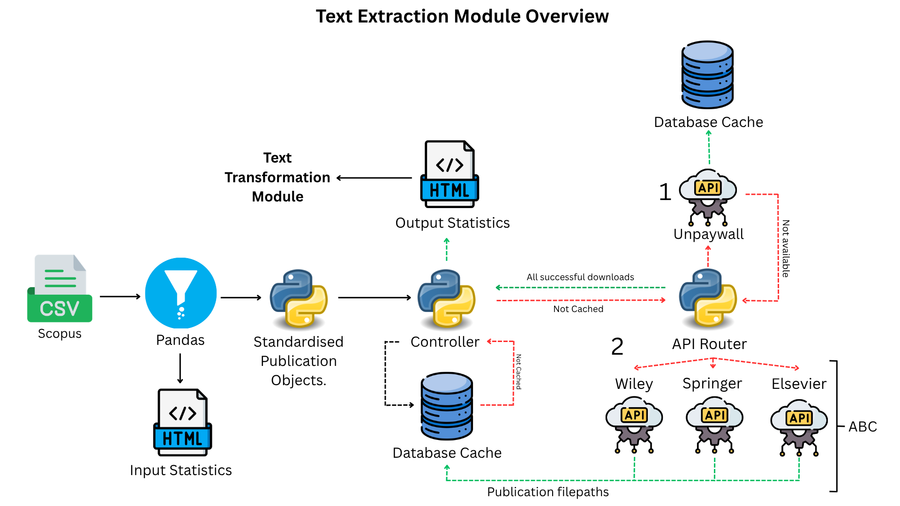

# Text-extraction.

----
This file contains all user documentation for the text-extraction module. Developer documentation for this module is
stored [here](/docs/devs/text_extraction). The text-extraction module is designed to take a single SCOPUS query as an
input via `.csv` file, extract the DOI's and then attempt to download as many as possible. The program works by
automatically searching the internet for an open-source full-text version of the DOI and then storing the download
within a single folder.

## Module Schematic.

## Files and folder paths.
All inputs and outputs live inside the active corpus folder, `corpora/<CORPUS_NAME>/`, selected via `CORPUS_NAME` in
the main config file - [config.py](/config.py). Downloaded full-text articles are saved to the `manuscripts/` subfolder
of the corpus. To make dealing with the large number of articles easier, downloaded full-text articles are saved with
a filename of the following format: `<api>_<random_number>.<filetype>`.

## Generating your input scopus query.
To generate the SCOPUS query `.csv` file, use the following link:
https://www.scopus.com/search/form.uri?display=advanced.

This project assumes you already know how to write SCOPUS queries and will not go into detail. For reference to writing
such queries, please see Elsevier documentation:
https://service.elsevier.com/app/answers/detail/a_id/11365/supporthub/scopus/#tips

* Once you have written your query, paste it into the advanced search bar and hit 'search'.
* You will now see an index page linking all the search results for your query. From here, click 'export' and then
'CSV'.
* You can select whichever information you like under heading 'What information do you want to export?' but for the
software to work correctly, you MUST include the following information:
    * Document title
    * Year
    * DOI
    * Publisher - **Not selected by default**.
    * Abstract - **Not selected by default**.
    * Keywords - **Not selected by default**.

* Click export and wait for the download to finish. For large queries, this might take some time.
* To set the file you just downloaded as the input for the software, rename it `scopus.csv` and place it inside your
corpus folder (`corpora/<CORPUS_NAME>/scopus.csv`). Make sure `CORPUS_NAME` in the main
[config file](/config.py) matches your corpus folder name.

## Module outputs.
The module will generate several outputs after it has attempted to download papers. Please note that although timeouts
and rate limits for downloads have been optimised, not all articles may download successfully on a first attempt. It is
recommended to run the software again to download any papers that might have been missed. Caching allows this to be done
easily and will speed up rerunning, as articles that have already been downloaded will not be reattempted.

The software generates a single `text_extraction_report_<timestamp>.html` report after all downloads are complete.
This file can be opened with any internet browser and is saved to the corpus `reports/` directory
(`corpora/<CORPUS_NAME>/reports/`).

The report contains up to two sections:

**Section 1 — Scopus Input Summary** (optional — only included when `extract_text()` is called with
`scopus_report=True`)**:**
   * The top 50 most frequent publishers within your SCOPUS query.
   * The top 50 publishers grouped via API — some publishers have different names but are part of the same publisher
group. For example, Elsevier hosts a vast number of different journals with different names. However, these articles can
all be downloaded from the same end-point. Hence, all Elsevier articles are grouped together under the same publisher.
   * Cumulative percentages of publisher groups in your SCOPUS query – useful for seeing which publishers make up the
majority of your query.

**Section 2 — Download Results:**
   * Cache status overview (previously cached, newly downloaded, failed).
   * Downloads per publisher group / API.
   * Cache status per publisher including historical cache.
   * Publications by year.

## Running the module.
The main module function is `extract_text()`. The function will automatically attempt to download all full-text articles
for your SCOPUS query. It takes two optional parameters:
   * `check_opensource` (default `True`) — set to False to skip the open-source download stage (direct arXiv,
bioRxiv/medRxiv and ChemRxiv routes, then the Unpaywall API) before publisher-specific APIs are tried.
   * `scopus_report` (default `False`) — set to True to include the Scopus input summary section in the
text-extraction report.