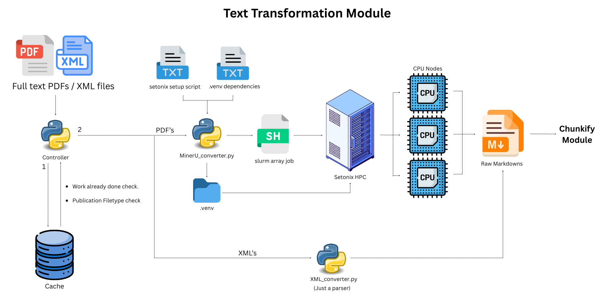

# Text-transformation.

----
This file contains all user documentation for the text-transformation module. Developer documentation for this module is
stored [here](/docs/devs/text_transformation). The text-transformation module takes the downloaded full-text articles
produced by the text-extraction module (PDFs and XMLs) and converts them into standardised Markdown files. These
Markdown files are then used as input for the chunkify module.

## Module Schematic.


## Overview
The module runs through the following stages:

1. **Cache cross-referencing** -- each publication is checked against the cache database to determine which filepath
   columns are already populated.
2. **Sorting** -- publications are sorted into three groups:
   * `needs_conversion` -- only a raw download exists (no Markdown yet).
   * `needs_processing` -- a raw Markdown file exists but no final cleaned version.
   * `fully_processed` -- all filepaths are set; no further action required.
3. **Conversion** -- publications in `needs_conversion` are dispatched to the appropriate converter based on their
   document type (XML or PDF).

## Files and folder paths.
Downloaded full-text articles are read from the corpus `manuscripts/` folder (`DOWNLOAD_DIR`). Converted raw
Markdown files are written to the corpus `markdowns/` folder (`RAW_MARKDOWN_DIR`). Each converted file is placed
inside a subdirectory named after the original file's stem, e.g. `corpora/<CORPUS_NAME>/markdowns/<stem>/<stem>.md`.

The active corpus is selected via `CORPUS_NAME` in [config.py](/config.py).

## Converters
The module includes two converters, selected automatically based on the file type of the downloaded article:

| Converter | Input | Description |
|-----------|-------|-------------|
| `ElsevierXmlConverter` | `.xml` files | Parses Elsevier full-text XML into Markdown. Extracts title, authors, abstract, keywords, body text, figures, tables, and references. Converts MathML formulas to LaTeX. |
| `MinerUPdfConverter` | `.pdf` files | Uses the MinerU CLI (OpenDataLab) to convert PDFs to Markdown. Runs locally by default (requires a CUDA-capable GPU), or delegates inference to a remote vLLM server hosting the MinerU VLM model via `transform_text(mineru_endpoint="vllm")`. |

## Module outputs
* **Raw Markdown files** in the corpus `markdowns/` folder, one per successfully converted publication.
* **`conversion_report_<timestamp>.html`** in the corpus `reports/` folder -- a summary report showing the number
  of publications converted, split by document type and conversion outcome.

## Running the module
Call `transform_text()` from `main.py` after `extract_text()` has completed. The function accepts and returns a list
of `Publication` objects.

```python
from main import download_corpus, transform_text

publications = download_corpus()
publications = transform_text(publications)
```

### Remote inference via vLLM
Setting `mineru_endpoint="vllm"` makes MinerU act as a thin client and send PDF inference to a remote
vLLM server hosting the MinerU VLM model, so no local GPU is required for conversion:

```python
publications = transform_text(publications, mineru_endpoint="vllm")
```

This requires `MINERU_VLLM_ENDPOINT` (e.g. `http://host:30000`, no trailing slash) and `MINERU_API_KEY`
(the key the vLLM server was started with) to be set in `secrets.env`; the run aborts up front with a
clear error if either is blank. Note the two modes write to different output subdirectories
(`markdowns/<stem>/auto/` locally vs `markdowns/<stem>/vlm/` remotely), so switching modes reconverts
publications that have not yet been cached.